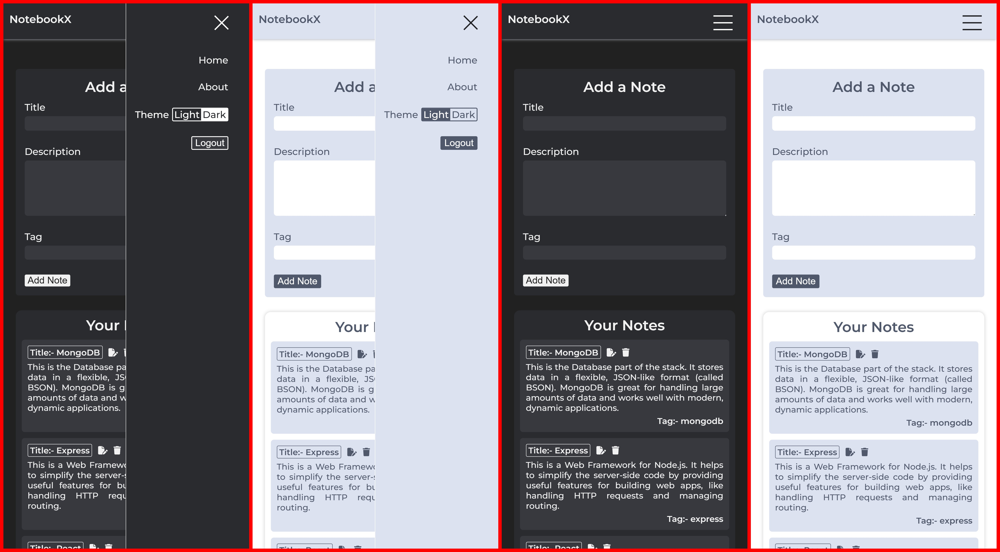

# NotebookX

**NotebookX** is a secure, user-friendly note-taking application built with the **MERN stack** (MongoDB, Express.js, React, Node.js). It enables users to create, edit, and manage personal notes with an emphasis on privacy and data security, using **JWT authentication** and modern encryption techniques.

## ✨ Features

- 🔐 Secure user authentication with **JWT** (JSON Web Tokens)
- 📝 Create, edit, and delete personal notes
- 🌓 Light and dark mode support
- 📱 Clean, responsive, and mobile-friendly UI
- ⚡ Fast development and building with **Vite**

## 🛠 Tech Stack

- **Frontend**: React (**Vite**), React Router, `Context API`, `react-masonry-css`
- **Backend**: Node.js, Express.js, MongoDB, Mongoose
- **Authentication**: JSON Web Tokens (JWT), bcryptjs
- **Development Tools**: Postman, Nodemon

## 📁 Folder Structure

```text
NotebookX/
|
|--- client/                # React frontend (Vite)
|   |--- public/            # Static files
|   |--- src/
|   |   |--- assets/        # Fonts, images, screenshots
|   |   |--- components/    # UI (AddNote, Alert, Login, NoteItem, SignUP)
|   |   |--- context/       # note & theme contexts
|   |   |--- layouts/       # Navbar
|   |   |--- pages/         # Home, About, Notes
|   |   |--- App.jsx
|   |   |--- main.jsx
|
|--- server/                # Node backend
|   |--- src/
|   |   |--- config/        # DB configs
|   |   |--- controllers/   # Request handlers (auth, note)
|   |   |--- middleware/    # Auth_middleware
|   |   |--- models/        # Mongoose schemas (Note, User)
|   |   |--- routes/        # Express routes
|   |   |--- validators/    # Request validation
|   |--- index.js           # Entry point
|
|--- .gitignore
|--- README.md
```

## ⚙️ Installation & Setup

1. **Clone the repository**
2. **Install Backend dependencies**
   ```bash
   cd server
   npm install
   ```
3. **Install Frontend dependencies**
   ```bash
   cd ../client
   npm install
   ```
4. **Environment Setup**
   In the `server/` directory, create a `.env` file:
   ```env
   PORT=5000
   MONGO_URI=your_mongo_connection_string
   JWT_SECRET=your_jwt_secret
   ```

## 🚀 Running the App

### Start Backend

Open a terminal:

```powershell
cd server
nodemon index
```

### Start Frontend

Open another terminal:

```powershell
cd client
npm run dev
```

Visit: **`http://localhost:5173/`**

---

## 🔍 API Documentation (Postman)

### **\*** Authentication **\***

#### --> Signup [POST]

**URL:** `localhost:5000/api/auth/signup`

**PAYLOAD:**

```json
{
  "name": "userOne",
  "email": "u1@gmail.com",
  "password": "123456"
}
```

**RESPONSE:**

```json
{
  "success": true,
  "message": "Signup success",
  "user": {
    "name": "userOne",
    "email": "u1@gmail.com"
  },
  "token": "..."
}
```

#### --> Login [POST]

**URL:** `localhost:5000/api/auth/login`

**PAYLOAD:**

```json
{
  "email": "u1@gmail.com",
  "password": "123456"
}
```

**RESPONSE:**

```json
{
  "success": true,
  "message": "Login success",
  "token": "..."
}
```

#### --> Fetch User [GET]

**URL:** `localhost:5000/api/auth/`

**HEADER:** `[Authorization: token]`

**RESPONSE:**

```json
{
  "success": true,
  "message": "User fetched successfully",
  "user": {
    "_id": "...userID",
    "name": "userOne",
    "email": "u1@gmail.com",
    "date": "...date",
    "__v": 0
  }
}
```

---

### **\*** Notes **\***

#### --> Add [POST]

**URL:** `localhost:5000/api/note/`

**PAYLOAD:**

```json
{
  "title": "First",
  "description": "Hello this is first note...",
  "tag": "General"
}
```

**RESPONSE:**

```json
{
  "success": true,
  "message": "Note added successfully",
  "note": {
    "user": "...userID",
    "title": "First",
    "description": "Hello this is first note...",
    "tag": "General",
    "_id": "...noteID",
    "date": "...date",
    "createdAt": "...createdTime",
    "updatedAt": "...updatedTime",
    "__v": 0
  }
}
```

#### --> Fetch all notes [GET]

**URL:** `localhost:5000/api/note/`

**HEADER:** `[Authorization: token]`

**RESPONSE:**

```json
{
    "success": true,
    "message": "Notes fetched successfully",
    "notes": [ {...}, {...} ]
}
```

#### --> Update [PUT]

**URL:** `localhost:5000/api/note/:id`

**PAYLOAD:**

```json
{
  "title": "First",
  "description": "Hello this is first note...U1",
  "tag": ""
}
```

**RESPONSE:**

```json
{
  "success": true,
  "message": "Note has been updated",
  "note": {
    "user": "...userID",
    "title": "First",
    "description": "Hello this is first note...U1",
    "tag": "General",
    "_id": "...noteID",
    "date": "...date",
    "createdAt": "...createdTime",
    "updatedAt": "...updatedTime",
    "__v": 0
  }
}
```

#### --> Delete [DELETE]

**URL:** `localhost:5000/api/note/:id`

**HEADER:** `[Authorization: token]`

**RESPONSE:**

```json
{
  "success": true,
  "message": "Note has been deleted",
  "note": {
    "user": "...userID",
    "title": "Second",
    "description": "Hello this is second note...U1",
    "_id": "...noteID",
    "date": "...date",
    "createdAt": "...createdTime",
    "updatedAt": "...updatedTime",
    "__v": 0
  }
}
```

## 📝 Notes

- `node_modules/` is excluded — run `npm install` to restore.
- `.env` is excluded — see `.env.example` for required keys.
- Frontend runs on **Vite** (port 5173) and Backend on **Node/Express** (port 5000).

---

## 📸 Screenshots

Here are a few previews of NotebookX in action.

### Home Page (Dark Mode)


### Responsive View (Mobile)



➡️ **Other Screenshots**

| Page/Component                | 🔗 Link                                         |
| ----------------------------- | ----------------------------------------------- |
| **Home (Light Mode)**         | [View](client/src/assets/images/HomeLight.png)  |
| **About (Dark Mode)**         | [View](client/src/assets/images/AboutDark.png)  |
| **About (Light Mode)**        | [View](client/src/assets/images/AboutLight.png) |
| **Login / Signup Form**       | [View](client/src/assets/images/Forms.jpeg)     |
| **Update Modal (Dark Mode)**  | [View](client/src/assets/images/ModalDark.png)  |
| **Update Modal (Light Mode)** | [View](client/src/assets/images/ModalLight.png) |
