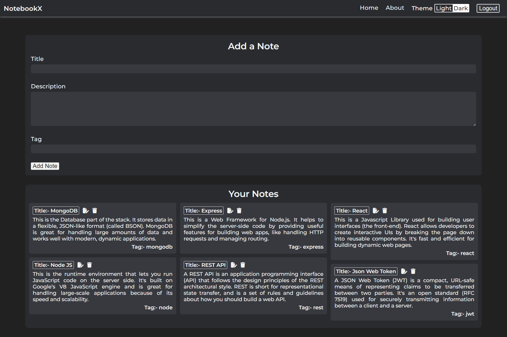

# NotebookX

**NotebookX** is a secure, user-friendly note-taking application built with the **MERN stack** (MongoDB, Express.js, React, Node.js). It enables users to create, edit, and manage personal notes with an emphasis on privacy and data security, using **JWT authentication** and modern encryption techniques.

## ✨ Features

- 🔐 Secure user authentication with **JWT** (JSON Web Tokens)
- 📝 Create, edit, and delete personal notes
- 🌓 Light and dark mode support
- 📱 Clean, responsive, and mobile-friendly UI

## 🛠 Tech Stack

- **Frontend**: React (CRA), React Router, `fetch`, `react-masonry-css` (for responsive grid layout)
- **Backend**: Node.js, Express.js, MongoDB, Mongoose
- **Authentication**: JSON Web Tokens (JWT), bcryptjs
- **Development Tools**: Thunder Client, Nodemon, Concurrently

## 📸 Screenshots

Here are a few previews of NotebookX in action.

### Home Page (Dark Mode)



### Responsive View (Mobile)


➡️ Other Screenshots

| Page/Component                | 🔗 Link                                        |
| ----------------------------- | ---------------------------------------------- |
| **Home (Light Mode)**         | [View](./Screenshots-NotebookX/HomeLight.png)  |
| **About (Dark Mode)**         | [View](./Screenshots-NotebookX/AboutDark.png)  |
| **About (Light Mode)**        | [View](./Screenshots-NotebookX/AboutLight.png) |
| **Login / Signup Form**       | [View](./Screenshots-NotebookX/Forms.jpeg)     |
| **Update Modal (Dark Mode)**  | [View](./Screenshots-NotebookX/ModalDark.png)  |
| **Update Modal (Light Mode)** | [View](./Screenshots-NotebookX/ModalLight.png) |

## 📁 Folder Structure

```
NotebookX
|
|--- backend-NotebookX
|    |-- middleware/
|    |-- models/
|    |-- routes/
|    |-- .env.example
|    |-- database.js
|    |-- index.js
|    |-- package.json
|
|--- favicon/
|
|--- fonts/
|
|--- public/
|
|--- Screenshots-NotebookX/
|
|--- src/
|    |-- components
|    |-- context
|        |-- note
|        |-- theme
|
|--- package.json
|--- README.md

```

## ⚙️ Installation & Setup

1. **Clone or extract the project**

   > Make sure `node_modules/` and `.env` are **not included** in the shared zip.

2. **Install frontend dependencies**

   ```bash
   npm install
   ```

3. **Install backend dependencies**

   ```bash
   cd backend-NotebookX
   npm install
   ```

4. **Create an environment config file**

   In `backend-NotebookX`, rename `.env.example` to `.env` and fill in:

   ```env
   PORT=5000
   MONGO_URI=your_mongo_connection_string
   JWT_SECRET=your_jwt_secret
   ```

## Running the App

You have a script called `notebookx` in `package.json`:

```json
"notebookx": "concurrently \"npm run start\" \"cd backend-NotebookX && nodemon index.js\""
```

Run both frontend and backend together:

```bash
npm run notebookx
```

- Frontend: `http://localhost:3000`
- Backend/API: `http://localhost:5000`

🔍 API Testing

- You can use **Thunder Client** (VS Code extension) or **Postman** to test your API routes like:
- `POST /api/auth/createuser`
- `POST /api/auth/login`
- etc.

## 📝 Notes

- `node_modules/` is excluded — run `npm install` to restore
- `.env` is excluded — provide `.env.example` instead
- Not deployed yet — local development only
- Backend + frontend in one project using Create React App

## 📄 License

This project is for personal or educational use.
